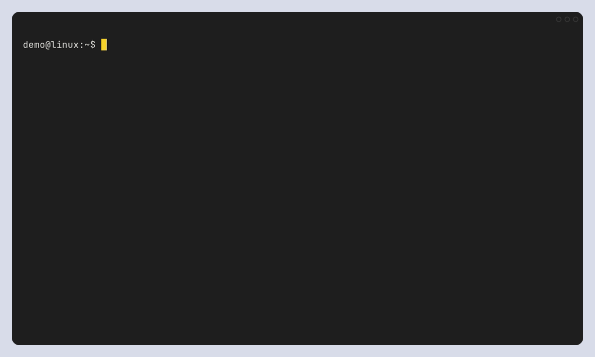

# TuxCleaner

TuxCleaner is a safety-first Linux cleanup, application uninstall, disk analysis, project artifact, and system status tool written in Rust. Its interaction model is inspired by [Mole](https://github.com/tw93/Mole), while its Linux rules are implemented independently around distribution-specific adapters.

The project is currently an MVP. It supports Arch Linux derivatives, Debian and Ubuntu derivatives, and Fedora and RHEL derivatives.



The [VHS tour](docs/tuxcleaner-demo.tape) runs the compiled CLI against isolated fictional files and package-manager fixtures. Every changing command uses dry-run mode, so no real package or user data is removed.

## Features

- Interactive terminal menu built with Ratatui
- Distribution detection through `/etc/os-release`
- Package cleanup adapters for `pacman`, `apt`, and `dnf`
- Explicit desktop application discovery and uninstall for `pacman`, APT, DNF, and Flatpak
- Known user, browser, and developer cache scanning
- Docker cleanup that never includes volumes
- Unused Flatpak runtime cleanup
- Read-only disk analysis with large personal files separated from hidden application data
- Old project artifact discovery for `node_modules`, `target`, `build`, `dist`, `.build`, and `.venv`
- Read-only CPU, memory, disk, load, and uptime status
- JSON output for automation
- Dry-run support and JSONL operation history
- Checksum-verified self-updates from GitHub Releases

## Install

Install the latest prebuilt release with one command:

```bash
curl -LsSf https://raw.githubusercontent.com/debba/tuxcleaner/main/install.sh | sh
```

The installer detects x86_64 or ARM64 and GNU libc or musl, downloads the matching GitHub Release archive, verifies its SHA-256 checksum, and installs `tuxcleaner`. It prefers `~/.local/bin` and uses `/usr/local/bin` when that directory is writable.

Install a specific version or directory:

```bash
curl -LsSf https://raw.githubusercontent.com/debba/tuxcleaner/main/install.sh \
  | TUXCLEANER_VERSION=0.2.0 TUXCLEANER_INSTALL_DIR="$HOME/bin" sh
```

To inspect the installer before running it:

```bash
curl -LsSf https://raw.githubusercontent.com/debba/tuxcleaner/main/install.sh -o install.sh
less install.sh
sh install.sh
```

Prebuilt targets:

- `x86_64-unknown-linux-gnu`
- `x86_64-unknown-linux-musl`
- `aarch64-unknown-linux-gnu`
- `aarch64-unknown-linux-musl`

### Install from source

TuxCleaner requires Rust 1.85 or newer.

```bash
cargo install --path .
```

Run `tuxcleaner` without arguments to open the interactive menu.

## Commands

```text
tuxcleaner clean
tuxcleaner clean --dry-run --yes
tuxcleaner clean --groups system,user --yes
tuxcleaner clean --json

tuxcleaner uninstall
tuxcleaner uninstall --search firefox
tuxcleaner uninstall --json
tuxcleaner uninstall --app pacman:firefox --dry-run --yes

tuxcleaner analyze
tuxcleaner analyze ~/Downloads --min-size 1GiB
tuxcleaner analyze --json

tuxcleaner purge
tuxcleaner purge --path ~/Projects --older-than-days 30 --dry-run --yes

tuxcleaner status
tuxcleaner status --json

tuxcleaner history
tuxcleaner history --json

tuxcleaner update --check
tuxcleaner update --dry-run
tuxcleaner update --yes
tuxcleaner update --version 0.2.0 --yes
```

`clean --json` without `--yes` is scan-only. This makes it safe to use for inventory scripts. Add `--yes` only when an automation is intended to execute every requested group.

Every command that can change the machine supports a dry run:

| Command | Preview mode |
| --- | --- |
| `clean` | `tuxcleaner clean --dry-run --yes` |
| `uninstall` | `tuxcleaner uninstall --app pacman:firefox --dry-run --yes` |
| `purge` | `tuxcleaner purge --dry-run --yes` |
| `update` | `tuxcleaner update --dry-run` |

`analyze`, `status`, `history`, and `update --check` are always read-only.

## Safety model

Every destructive workflow follows the same boundary:

1. Scan without modifying the system.
2. Report exact groups, applications, or project artifacts.
3. Require an explicit interactive selection or `--yes`.
4. Validate every path or command against a compiled allowlist.
5. Execute each action independently and record its result.

### Safety at a glance

| Workflow | Read-only discovery | Required authorization | Independent execution boundary |
| --- | --- | --- | --- |
| `clean` | Known cache paths and fixed maintenance actions | Interactive group selection or `--yes` | Exact path and command allowlists |
| `uninstall` | Explicitly installed desktop applications and Flatpaks | Interactive application selection or exact `--app` IDs with `--yes` | Package identifier validation, protected-package refusal, and a transaction preview |
| `purge` | Reproducible project artifacts with known directory names | Interactive artifact selection or `--yes` | Exact in-home paths, no symlinks, and no `.git` traversal |
| `update` | Exact GitHub Release asset for the current Linux target | Interactive confirmation or `--yes` | SHA-256 verification followed by atomic binary replacement |

The uninstall path has an additional review gate:

```text
read-only catalog
      -> exact application selection
      -> package-manager transaction preview
      -> confirmation
      -> fixed source-specific command
      -> recorded result, with user data preserved
```

`--dry-run` crosses every validation and preview boundary but stops before the operation that changes the machine. `--yes` skips prompts only; it does not bypass identifier, path, command, checksum, or protected-package validation.

Additional protections include:

- `/`, the home directory itself, `.git`, `.config`, `.ssh`, and `.gnupg` are rejected cleanup targets.
- Symlink targets and paths with symlink ancestors are rejected.
- Cache deletion uses exact paths and Rust filesystem APIs, never shell globs.
- Pacman keeps one cached version of installed packages and removes cached packages that are no longer installed.
- The systemd journal is reduced only when it exceeds 200 MiB.
- Docker volumes are never passed to a cleanup command.
- Large personal files are reported but never selected or deleted by `analyze`.
- Hidden application data is listed separately with a warning.
- Project artifacts are never selected by default.
- Application discovery includes only explicitly installed native packages that own visible desktop entries, plus Flatpak applications.
- An uninstall selection uses an exact source-qualified ID, such as `apt:firefox` or `flatpak-user:org.example.App`.
- Native package managers must produce a removal preview before TuxCleaner asks for final confirmation.
- Critical system packages are denied, and application configuration and user data are preserved.

Read [SECURITY.md](SECURITY.md) for the complete trust boundaries.

## Distribution adapters

| Family | Detected examples | Package cleanup | Application uninstall |
| --- | --- | --- | --- |
| Arch | Arch, Manjaro, EndeavourOS | `paccache -rk1`, then `paccache -ruk0` | `pacman` and Flatpak |
| Debian | Debian, Ubuntu, Linux Mint, Pop!_OS | `apt-get clean` | APT and Flatpak |
| Fedora | Fedora, RHEL, CentOS, Rocky, AlmaLinux | `dnf clean all` | DNF and Flatpak |

Unknown distributions still receive Flatpak uninstall, user-cache, developer-cache, analysis, purge, and status functionality. Native package cleanup and uninstall are skipped with a warning.

## Architecture

The binary is intentionally split into small modules:

```text
CLI / Ratatui menu
        |
        +-- distribution adapter --> package cleanup actions
        +-- application catalog --> explicit desktop apps
        +-- scanner -------------> allowlisted cache actions
        +-- analyzer ------------> read-only disk report
        +-- purge scanner --------> explicit project artifacts
        |
        +-- safety executor ------> path, package, and command validation
                                      |
                                      +-- JSONL history
```

The command runner is a trait so privileged or external commands can be replaced with a fake runner in tests. Distribution parsing and scanners accept fixture paths rather than depending on the development machine.

More design detail is available in [docs/architecture.md](docs/architecture.md).

## Development

```bash
cargo fmt --all -- --check
cargo clippy --all-targets --all-features -- -D warnings
cargo test --all-targets
sh -n install.sh scripts/package-release.sh scripts/render-demo.sh scripts/render-social-preview.sh docs/demo/fixtures/bin/*
sh tests/install.sh
```

Tests cover distribution fixtures, application catalog providers, protected-package rejection, exact uninstall commands, size parsing, traversal exclusions, symlink behavior, history ordering, dry-run preservation, and JSON CLI contracts. CI also runs smoke tests in Arch, Ubuntu, and Fedora containers.

The README tour is recorded from `docs/tuxcleaner-demo.tape` with fictional fixtures. Regenerate it with `scripts/render-demo.sh`; the same command extracts a real menu frame and rebuilds the GitHub social preview. This optional documentation task requires VHS, ttyd, ffmpeg, ImageMagick, Adwaita Sans, and JetBrains Mono.

## Credits and license

TuxCleaner is an original Linux implementation inspired by Mole's terminal-focused product structure and safety-first interaction model. Mole is maintained by tw93 and distributed under GPL-3.0.

TuxCleaner is licensed under GPL-3.0-only. See [LICENSE](LICENSE).
